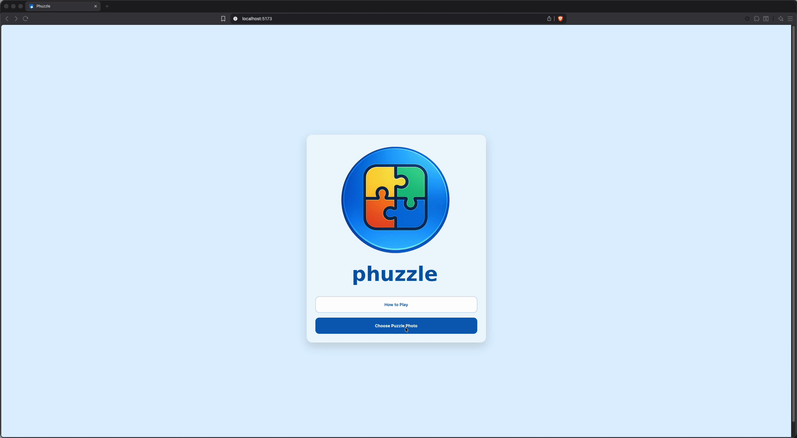

# Phuzzle

A cozy, modern jigsaw puzzle game built with React.  
Upload an image, break it into pieces, and snap them together piece by piece.

---

## Table of Contents

- [Preview](#preview)
- [What is Phuzzle?](#-what-is-phuzzle)
- [User Stories](#user-stories)
- [Features](#-features)
- [Roadmap](#-roadmap)
- [Tech Stack](#-tech-stack)
- [Getting Started](#-getting-started)
- [Adding Sample Puzzles](#-adding-sample-puzzles)
- [Project Structure](#-project-structure)
- [Contributing](#-contributing)
- [Team](#-team)
- [License](#-license)

---

## Preview

### Gameplay Demo

[](https://phuzzle.vercel.app/)

---

## What is Phuzzle?

Phuzzle is a fully interactive jigsaw puzzle experience focused on:

- Smooth snapping and merging
- Satisfying, tactile interactions
- Mobile-first usability
- Clean, maintainable game logic

It started as a small side project and evolved into a surprisingly deep puzzle engine with strong UX polish.

**Purpose:**  
A calm, cozy puzzle you can open anytime — part mindfulness, part challenge.

---

## User Stories

### Players want:

- To upload an image and instantly generate a puzzle
- Smooth, intuitive drag-and-drop
- Pieces that snap when correctly aligned
- A reference image for guidance
- A relaxing, clutter-free experience

### Developers want:

- Predictable puzzle-generation logic
- A structure that supports expansion
- A roadmap that welcomes contribution

---

## Features

### Core Gameplay

- Drag-and-drop jigsaw pieces with rotation
- Classic interlocking jigsaw piece shapes
- Board and neighbor snapping
- Group merging so connected pieces move together
- Multiple difficulty levels (3×3 to 6×6 grids)

### UX & Polish

- Reference image preview overlay
- Progress counter and timer (with pause)
- Confetti celebration on completion 🎉
- Sound effects (snap, rotate, place, complete)
- Fullscreen mode
- Custom fonts and icons (Inter, Fredoka, Lucide)

### Mobile Support

- Touch drag
- Tap to rotate
- Long-press to send pieces to the tray
- Haptic feedback
- Mobile-safe layouts and gestures

### Accessibility & Controls

- Keyboard shortcuts (Tab, arrows, R to rotate)
- First-time tutorial overlay
- Designed for relaxed, low-pressure play

### Persistence

- Auto-save puzzle progress
- Resume across browser sessions

### Daily Challenge
- Same puzzle for everyone each day (deterministic, no backend)
- Streak tracking for consecutive days completed
- One-tap start from the menu

---

## Roadmap

### Completed

- Dark mode
- Undo
- Ghost / hint preview
- Share completed puzzle image
- Time modes (elapsed, countdown, active-only, relaxed, best time)
- Daily puzzle challenge

### Planned

- Redo
- Edge-piece filtering
- Zoom and pan for large puzzles
- Daily puzzle challenge
- Player stats and achievements
- Import puzzle from URL
- Camera capture for custom photos
- PWA / offline support

---

## Tech Stack

| Category  | Tools          |
| --------- | -------------- |
| Framework | React          |
| Language  | TypeScript     |
| Build     | Vite           |
| Rendering | HTML Canvas    |
| CI/CD     | GitHub Actions |
| Hosting   | Vercel         |

---

## Getting Started

```bash
git clone https://github.com/NickTheDevOpsGuy/phuzzle.git
cd phuzzle
npm install
npm run dev
```

---

## Adding Sample Puzzles

Drop images into:

```
src/app/assets/puzzles/<category>/
```

Example:

```
src/app/assets/puzzles/
  animals/
    kitten.png
  nature/
    mountain.jpg
```

Images are auto-discovered.  
Category = folder name, puzzle name = filename.

---

## Project Structure

<details>
<summary>📁 Click to expand file structure</summary>

```plaintext

.
├── .github
│   ├── ISSUE_TEMPLATE
│   │   ├── bug.yml
│   │   ├── config.yml
│   │   ├── documentation.yml
│   │   ├── enhancement_refactor.yml
│   │   ├── feature_request.yml
│   │   └── question_discussion.yml
│   ├── workflows
│   │   ├── CODEOWNERS
│   │   ├── Phuzzle.yml
│   │   └── vercel-production.yml
│   └── pull_request_template.md
├── .husky
│   ├── pre-commit
│   └── pre-push
├── .vite
│   └── deps
│       ├── _metadata.json
│       └── package.json
├── public
│   └── favicon.svg
├── scripts
│   └── precheck.sh
├── src
│   ├── app
│   │   ├── assets
│   │   │   ├── puzzles
│   │   │   │   ├── animals
│   │   │   │   │   ├── bear.png
│   │   │   │   │   └── rabbit.png
│   │   │   │   ├── demo
│   │   │   │   │   ├── blue_square_thumb.png
│   │   │   │   │   ├── green_triangle_thumb.png
│   │   │   │   │   ├── red_circle_thumb.png
│   │   │   │   │   └── yellow_star_thumb.png
│   │   │   │   ├── flowers
│   │   │   │   │   ├── daisy.png
│   │   │   │   │   ├── flower_bed.png
│   │   │   │   │   ├── lavender.png
│   │   │   │   │   └── sunflower.png
│   │   │   │   └── food
│   │   │   │       ├── charcuterie_board.png
│   │   │   │       ├── curries_and_rice.png
│   │   │   │       ├── fruit_platter.png
│   │   │   │       └── pasta_dishes.png
│   │   │   └── ui
│   │   │       └── phuzzle-logo-512.png
│   │   ├── audio
│   │   │   └── sounds.ts
│   │   ├── components
│   │   │   ├── Button
│   │   │   │   ├── Button.module.css
│   │   │   │   └── Button.tsx
│   │   │   ├── DropDown
│   │   │   │   ├── Dropdown.module.css
│   │   │   │   └── Dropdown.tsx
│   │   │   ├── HowToPlay
│   │   │   │   ├── index.ts
│   │   │   │   ├── TutorialOverlay.module.css
│   │   │   │   └── TutorialOverlay.tsx
│   │   │   ├── Modal
│   │   │   │   ├── Modal.module.css
│   │   │   │   └── Modal.tsx
│   │   │   ├── PieceTray
│   │   │   │   ├── PieceTray.module.css
│   │   │   │   └── PieceTray.tsx
│   │   │   ├── ShortcutsModal
│   │   │   │   ├── ShortcutsModal.module.css
│   │   │   │   └── ShortcutsModal.tsx
│   │   │   ├── ThemeToggle
│   │   │   │   ├── ThemeToggle.module.css
│   │   │   │   └── ThemeToggle.tsx
│   │   │   └── Tray
│   │   │       ├── Tray.module.css
│   │   │       └── Tray.tsx
│   │   ├── daily
│   │   │   └── dailyPuzzle.ts
│   │   ├── data
│   │   │   └── samplePuzzles.ts
│   │   ├── hooks
│   │   │   ├── useKeyboardShortcuts.ts
│   │   │   └── useTheme.tsx
│   │   ├── puzzle
│   │   │   ├── canvas
│   │   │   │   ├── pickPiece.ts
│   │   │   │   ├── renderBoard.ts
│   │   │   │   ├── renderBoardHelpers.ts
│   │   │   │   ├── renderTrayPiece.ts
│   │   │   │   └── shape.ts
│   │   │   ├── factories
│   │   │   │   └── createInitialPieces.ts
│   │   │   ├── colorUtils.ts
│   │   │   ├── config.ts
│   │   │   ├── groupUtils.ts
│   │   │   ├── PuzzleManager.ts
│   │   │   ├── puzzleStorage.ts
│   │   │   ├── shape.ts
│   │   │   ├── snapLogic.ts
│   │   │   ├── types.ts
│   │   │   └── undoManager.ts
│   │   ├── screens
│   │   │   ├── Menu
│   │   │   │   ├── MenuScreen.module.css
│   │   │   │   └── MenuScreen.tsx
│   │   │   ├── NewGame
│   │   │   │   ├── NewGameScreen.module.css
│   │   │   │   └── NewGameScreen.tsx
│   │   │   ├── Play
│   │   │   │   ├── components
│   │   │   │   │   ├── CompletionOverlay.tsx
│   │   │   │   │   ├── DragPreview.tsx
│   │   │   │   │   ├── HeaderMenu.tsx
│   │   │   │   │   ├── headerMenuConfig.tsx
│   │   │   │   │   ├── index.ts
│   │   │   │   │   ├── PauseOverlay.tsx
│   │   │   │   │   ├── PlayHUD.tsx
│   │   │   │   │   └── TopBarButtons.tsx
│   │   │   │   ├── hooks
│   │   │   │   │   ├── pointerHandlers
│   │   │   │   │   │   ├── dragLog.ts
│   │   │   │   │   │   ├── mouseHandlers.ts
│   │   │   │   │   │   ├── shared.ts
│   │   │   │   │   │   ├── touchHandlers.ts
│   │   │   │   │   │   └── types.ts
│   │   │   │   │   ├── useCoarsePointer.ts
│   │   │   │   │   ├── useDownloadImage.ts
│   │   │   │   │   ├── useHaptics.ts
│   │   │   │   │   ├── useInputHints.ts
│   │   │   │   │   ├── usePlayScreenAnimation.ts
│   │   │   │   │   ├── usePlayScreenManager.ts
│   │   │   │   │   ├── usePlayScreenShortcuts.ts
│   │   │   │   │   ├── usePlayScreenTimer.ts
│   │   │   │   │   ├── usePlayScreenUI.ts
│   │   │   │   │   ├── usePointerHandlers.ts
│   │   │   │   │   ├── usePuzzleLifecycle.ts
│   │   │   │   │   ├── useShareResults.ts
│   │   │   │   │   └── useTimeModeConfig.ts
│   │   │   │   ├── PlayScreen.module.css
│   │   │   │   ├── PlayScreen.tsx
│   │   │   │   ├── playScreenUtils.ts
│   │   │   │   ├── playUtils.ts
│   │   │   │   └── timeMode.ts
│   │   │   └── Setup
│   │   │       ├── hooks
│   │   │       │   ├── index.ts
│   │   │       │   ├── useGridConfig.ts
│   │   │       │   └── useImagePicker.ts
│   │   │       ├── SetupScreen.module.css
│   │   │       └── SetupScreen.tsx
│   │   ├── styles
│   │   │   └── global.css
│   │   ├── App.tsx
│   │   ├── main.tsx
│   │   └── vite-env.d.ts
│   └── types
│       ├── canvas-confetti.d.ts
│       └── vite-env.d.ts
├── .env.development
├── .env.example
├── .gitignore
├── .prettierignore
├── .prettierrc.yml
├── CONTRIBUTORS.md
├── eslint.config.ts
├── index.html
├── LICENSE.md
├── package-lock.json
├── package.json
├── README.md
├── tsconfig.app.json
├── tsconfig.app.tsbuildinfo
├── tsconfig.json
├── tsconfig.node.json
├── vercel.json
└── vite.config.ts

```

</details>

---

## Contributing

We <strong>love help</strong>.

If you want to:

- fix bugs
- improve performance
- add features
- learn how puzzle engines work

**DM us** to join the Discord and get involved.

No gatekeeping. No ego. Just building something fun together.

---

## Team

Built by:

- **Nick**
- **Vinay**
- **Hannah**

With help from the wider community ❤️  
See all contributors here → **[CONTRIBUTORS.md](./CONTRIBUTORS.md)**

Different strengths, shared ownership, great teamwork.

---

## License

MIT License. See [LICENSE.md](./LICENSE.md).
