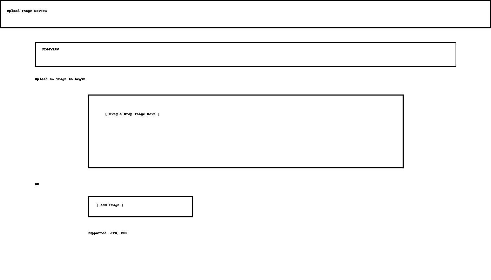
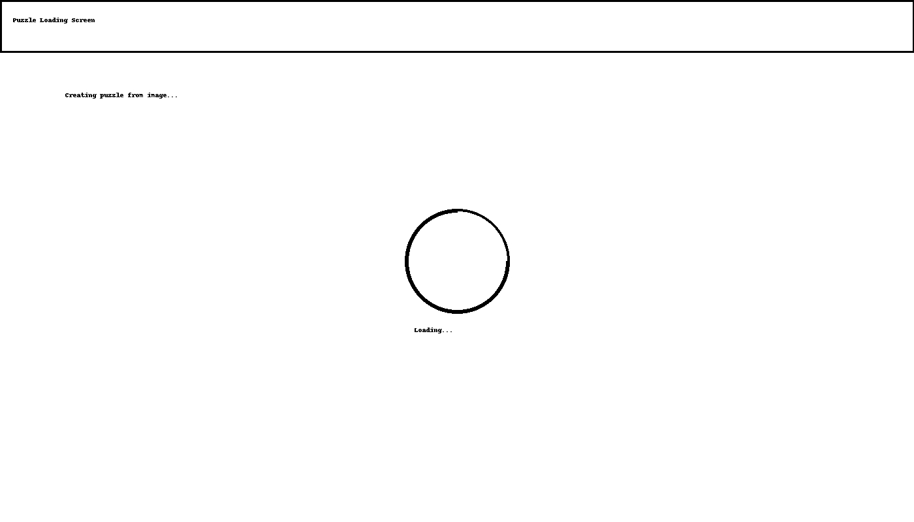
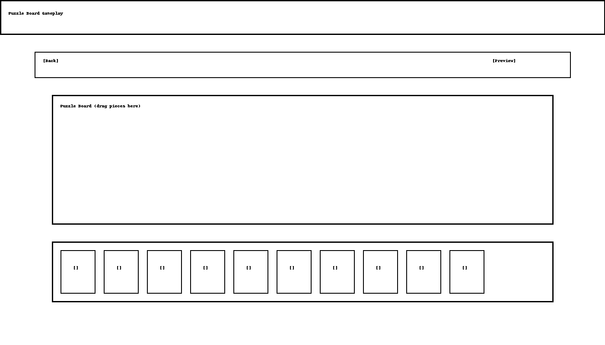
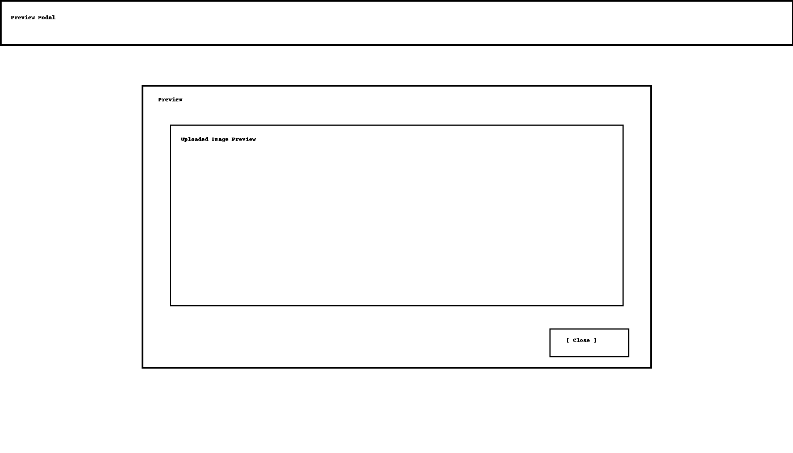

# 🧩 JiggySaw

*A raccoon-powered Unity jigsaw game built for smooth piece-snapping satisfaction.* 🦝✨


------------------------------------------------------------------------

## 📘 Table of Contents

- [🖼 Preview](#-preview)
- [🧩 About JiggySaw](#-about-jiggysaw)
- [📋 User Stories](#-user-stories)
- [🧪 Testing](#-testing)
- [🖌️ Wireframes / Mockups](#️-wireframes--mockups)
- [🚀 Features](#-features)
- [🛣️ Roadmap](#-roadmap)
- [🧭 Extended Roadmap](#-extended-roadmap)
- [🧱 Tech Stack](#-tech-stack)
- [📦 Getting Started](#-getting-started)
- [📂 Project Structure](#-project-structure)
- [🤝 Contributing](#-contributing)
- [🧑‍🤝‍🧑 Collaborators](#-collaborators)
- [🦝 Built by NickDoesDevOps](#-built-by-nickdoesdevops)

------------------------------------------------------------------------

## 🖼 Preview

### Gameplay Demo

*(Replace with a GIF once you have gameplay)*  


> 🎞️ Captured directly from the Unity Editor

------------------------------------------------------------------------

## 🎮 Play the Latest Build

A downloadable build will be available once the first playtest is released.

------------------------------------------------------------------------

## 🧩 About JiggySaw

**JiggySaw** is a Unity-based jigsaw puzzle game that turns relaxing piece-snapping into a smooth, satisfying experience.  
Powered by C# and a lightweight 2D setup, it focuses on clear visuals, fluid drag-and-drop, and that "just one more piece" feeling.

### 🧭 Purpose

A calm, focused puzzle experience you can open anytime — part mindfulness, part cozy challenge.

------------------------------------------------------------------------

## 📋 User Stories

### **Players Want…**

- To upload an image and instantly generate a puzzle from it.
- To drag pieces smoothly and intuitively.
- To have pieces snap into place when they are correctly aligned.
- To preview the original image for reference.
- To enjoy clean visuals with no clutter or distractions.
- To play a relaxing puzzle at their own pace.

### **Developers Want…**

- Modular, readable C# scripts.
- A well-defined puzzle-generation flow.
- A structure that supports expansion (mobile, new puzzle sizes, etc).
- A roadmap that invites contribution.

------------------------------------------------------------------------

## 🧪 Testing

### ✔️ Manual Testing Completed

- Drag & Drop interaction across various speeds
- Snap tolerance accuracy
- Correct piece slicing from uploaded images
- JPG + PNG upload validation
- Preview modal display correctness
- Random scatter boundaries checked
- No crashes with large images tested manually

### ✔️ Planned Automated Testing

- `SnapPoint` unit tests
- Image upload validation tests
- Play Mode drag-and-drop automation
- Puzzle reconstruction validation

------------------------------------------------------------------------

## 🖌️ Wireframes / Mockups

### **Upload Your Image Screen**


### **Puzzle Loading Screen**


### **Puzzle Board Gameplay**


### **Preview Modal**


------------------------------------------------------------------------

## 🚀 Features

- 🧩 **Smooth Piece Dragging** — responsive mouse controls for natural movement.
- 🔒 **Snapping Detection** — pieces lock neatly when placed near their target.
- 🎯 **Slot-Based Layout** — every piece knows exactly where it belongs.
- 🔀 **Randomized Start Positions** — every puzzle starts differently.
- 💾 **Puzzle Progress Persistence** — *(planned)* resume right where you left off.
- 🎨 **Clean 2D Visuals** — crisp sprites and a simple, calm UI.
- 🔊 **Optional SFX** — satisfying clicks when pieces snap into place.
- ⚡ **Lightweight C# Logic** — minimal, readable scripts powering every interaction.
- 📸 **Custom Image Import** — *(planned)* upload any image to create a puzzle.

------------------------------------------------------------------------

## 🛣️ Roadmap

### ✅ Completed

- [x] 2D scene setup
- [x] Puzzle piece prefab
- [x] Basic drag-and-drop
- [x] Snapping logic prototype
- [x] Random scatter placement

------------------------------------------------------------------------

### 🚧 In Progress / Planned

- [ ] Multiple puzzle sizes (3×3, 4×4, 5×5…)
- [ ] Custom image import
- [ ] Win animation + confetti
- [ ] Light background music
- [ ] Mobile support (touch drag)
- [ ] Level selection screen
- [ ] Save/Load system
- [ ] Edge shaping / classic jigsaw cuts

------------------------------------------------------------------------

## 🧭 Extended Roadmap

*(Optional — fill in as the project grows)*

------------------------------------------------------------------------

## 🧱 Tech Stack

-----------------------------------------------------------------------
Category      | Technologies / Tools
------------- | -------------------------------------------------------
🎮 Engine     | Unity 2022+
🧠 Scripts    | C# MonoBehaviours
🎨 Art        | Unity Sprites
🖱 Input      | Unity Input System
🔧 Tooling    | GitHub Actions (planned)
-----------------------------------------------------------------------

------------------------------------------------------------------------

## 📦 Getting Started

1. Clone:

```bash
git clone https://github.com/NickTheDevOpsGuy/JiggySaw.git
```

2. Open in **Unity Hub (2022+)**

3. Press **Play** to run.

------------------------------------------------------------------------

## 📂 Project Structure

```
<details>
<summary>📁 Click to expand file structure</summary>
.
├── .github
│   ├── ISSUE_TEMPLATE
│   │   ├── bug.yml
│   │   ├── config.yml
│   │   ├── documentation.yml
│   │   ├── enhancement_refactor.yml
│   │   ├── feature_request.yml
│   │   └── question_discussion.yml
│   └── pull_request_template.md
├── .gitignore
├── Assets
│   ├── Art
│   ├── Prefabs
│   ├── Scenes
│   ├── Scripts
│   └── UI
├── CONTRIBUTORS.md
├── docs
│   ├── banner.png
│   ├── board_mockup.png
│   ├── logo.png
│   ├── pieces_mockup.png
│   ├── preview_mockup.png
│   └── upload_mockup.png
└── README.md

</details>
```

------------------------------------------------------------------------

## 🤝 Contributing

PRs welcome — ideas, fixes, features… all help make the puzzle feel smoother.

------------------------------------------------------------------------

## 🧑‍🤝‍🧑 Collaborators

🤝 

Meet all our amazing contributors here:

➡️ **[CONTRIBUTORS.md](./CONTRIBUTORS.md)**

------------------------------------------------------------------------

## 🦝 Built by NickDoesDevOps

Created with ☕, curiosity, Unity magic, and raccoon energy.
